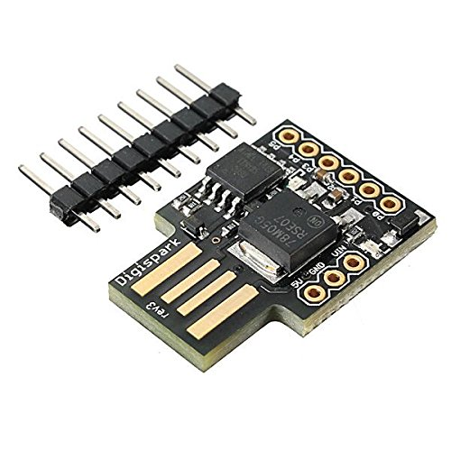
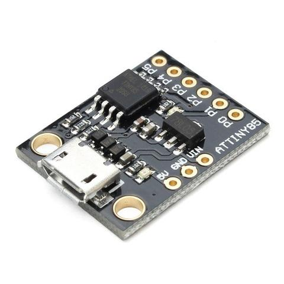
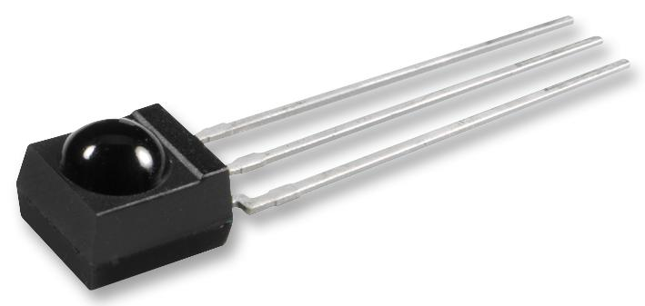
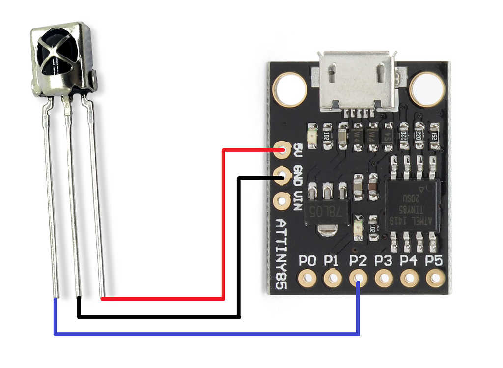

### Easy IR System

This project builds a USB IR receiver that acts as a keyboard and is
controllable via any IR remote.

It can also be seen as a low-cost (~3 USD), 'positive', configurable, and a
more fun version of the [USB Rubber Ducky](https://shop.hak5.org/products/usb-rubber-ducky-deluxe).

I use this USB-powered IR-to-keyboard-translator to control my RPi-powered home
music system.


Note: This project is built on top of [this 'Instructables Project'](https://www.instructables.com/Digispark-IR-Receiver-Keyboard/) by `MatMk`.


### Hardware Requirements

- Digispark USB board

- Vishay TSOP34438 / TSOP14438

- An IR remote






### Software Requirements

- Arduino IDE

- Python 3.5+

- Linux for maximum fun ;)


### Hardware Circuit



Image Credits: https://www.instructables.com/Digispark-IR-Receiver-Keyboard/ (MatMk)

Note: Check the exact datasheet for the pinout of the IR receiver module. We
strongly recommend using original Vishay IR modules - their performance is
extraordinary.


### Our Improvements

- The Digispark board only needs to be programmed once.

- We get a universal extensible IR receiver without requiring any firmware
  changes.

- Secret Sauce: The mapping between the IR remote keys and corresponding
  actions is done at a higher-level in Python.


### Hardware Setup

- Clone this repository.

  ```
  git clone --recursive https://github.com/kholia/Easy-IR-System.git ~/Easy-IR-System
  ```

- Install an [improved version of the Digistump AVR core for Arduino](https://github.com/ArminJo/DigistumpArduino)
  in the Arduino IDE.

  Read [this 'Connecting and Programming Your Digispark' article carefully](https://digistump.com/wiki/digispark/tutorials/connecting)
  to setup the Arduino IDE to work with Digispark boards. ATTENTION: Instead of using the `http://digistump.com/package_digistump_index.json`
  URL, use [this URL](https://raw.githubusercontent.com/ArminJo/DigistumpArduino/master/package_digistump_index.json)
  to setup the Digispark board in the Arduino IDE.

  Ensure that you have the `Blink` example working before moving ahead.

- **OPTIONAL STEP** Update the `micronucleus` bootloader to 2.5.x (September 2020).

  Setup updated micronucleus helper:

  ```
  $ cd ~/Easy-IR-System/micronucleus/commandline

  $ make

  cp micronucleus ~/.arduino15/packages/digistump/tools/micronucleus/2.0a4/
  cp micronucleus ~/.arduino15/./packages/ATTinyCore/tools/micronucleus/2.0a4/micronucleus  # if needed
  ```

  You can now flash the new bootloader using the `Tools > Burn Bootloader`
  option in the Arduino IDE.

- Setup the [TrinketHidCombo library](https://github.com/adafruit/Adafruit-Trinket-USB).

  ```
  cd ~/Easy-IR-System/

  ln -s `pwd`/repositories/Adafruit-Trinket-USB/TrinketHidCombo ~/Arduino/libraries
  ```

- Upload the [Easy-IR-Receiver firmware](./Easy-IR-Receiver) to the Digispark
  board using the Arduino IDE.


### Testing Process

- Once the `Easy-IR-Receiver` fimware has been uploaded, press a couple of
  buttons on the IR remote.

- You should see some characters getting typed on our computer. These are the
  `hex codes` we need.

- If you don't see these `hex codes` getting typed, see the `Debugging Notes`
  section.


### Software Setup

At this point, our hardware setup is 100% done and tested. Now, we need to map
these `hex codex` (being emitted by the Easy-USB-IR hardware) to actions. You
can customize the included [kdaemon.py](./kdaemon.py) program to do this.

Setup dependencies for `kdaemon.py`:

```
pip3 install -r requirements.txt
```

Once this is done, simply run the `kdaemon.py` program and have fun ;)


### Debugging Notes

- Use this [firmware](https://github.com/sztanpet/digispark-ir-keyboard/blob/master/digispark-ir-keyboard.ino)
  for debugging stuff.

- http://www.harctoolbox.org/arduino_nano.html is a pretty useful, fun project
  for reversing and debugging IR stuff.

- http://hscope.martinloren.com/HS101-oscilloscope.html is also a fun, useful
  project for debugging IR stuff.


### References / Credits

- https://www.analysir.com/blog/product/infrared-component-starter-kits/

- https://abhijith.live/build-cheaper-version-of-rubber-ducky-using-digispark-attiny85/

- https://www.yeggi.com/q/digispark+case+by/10

- https://variax.wordpress.com/2018/08/23/simple-diy-volume-control-knob/
